# ESAPI Showcase: Complex Clinical Workflow Scripts

Visual showcase of larger Eclipse Scripting API (ESAPI) tools and workflow ideas used in radiotherapy treatment planning environments.

This repository is intentionally a showcase, not a source-code distribution. The screenshots and notes are meant to help ESAPI developers design safer user interfaces, plan-check workflows, reporting tools, DICOM export helpers, and data-mining utilities.

Last refreshed: June 2026.

## Scope

- Screenshots and design notes for complex ESAPI GUI and stand-alone workflows.
- Modernized ESAPI guidance for Eclipse/ESAPI 18.x-era development.
- A shareable AI assistant skill for ESAPI code review and scripting support: [`skills/esapi-scripting/SKILL.md`](skills/esapi-scripting/SKILL.md).
- No patient data, no clinical source code, and no site-specific rule engine implementation.

Use GitHub issues for corrections or discussion. Do not post patient-identifiable information, screenshots from clinical patients, credentials, ARIA database details, or unapproved clinical scripts.

## Why Source Code Is Not Included

The original tools were developed for local clinical workflows and contain site-specific assumptions, naming conventions, safety checks, and UI behavior. Releasing that code without local commissioning context could encourage unsafe reuse.

For real clinical deployment, each institution must implement and validate its own requirements, risk analysis, QA tests, approval workflow, and upgrade checks.

## Current ESAPI Notes

The first versions of these tools were built around older Eclipse/ESAPI releases. For new work, verify behavior against the ESAPI version installed at your institution.

Key ESAPI 18.x-era reminders:

- ESAPI 18.0 projects target .NET Framework 4.8.
- Binary plug-ins and stand-alone executables should be built x64.
- ESAPI 18.0 assemblies use version `1.0.600`.
- Common script types include single-file plug-ins, binary plug-ins (`.esapi.dll`), stand-alone executables, and ESAPI 18+ approval extension plug-ins.
- Stand-alone executables must create ESAPI with `Application.CreateApplication()` on a single STA thread.
- Stand-alone scripts may open database patients, but only one active patient object model should be held at a time; call `Application.ClosePatient()` before opening another patient.
- Do not use live ESAPI objects from worker threads, `Task`, background workers, async continuations, or PLINQ. Copy primitive values out first.
- Write-enabled automation requires explicit governance: script approval, `Patient.BeginModifications()`, controlled save/discard behavior, and clinical validation.
- Approval extensions should primarily report readiness findings during plan approval. Blocking errors should be rare, validated, and institutionally agreed.

More detail is in [`docs/ESAPI_18_UPDATE_NOTES.md`](docs/ESAPI_18_UPDATE_NOTES.md).

## Showcase

### 1. PlanCheck

Plan and plan-sum checks with dose constraints, plan-parameter checks, interactive DVH review, and report generation.

The script structure was initially inspired by [LDClark/PlanCheck](https://github.com/LDClark/PlanCheck), then heavily adapted for local workflows.


Newer GUI concept with interactive constraint editing and plan comparison:

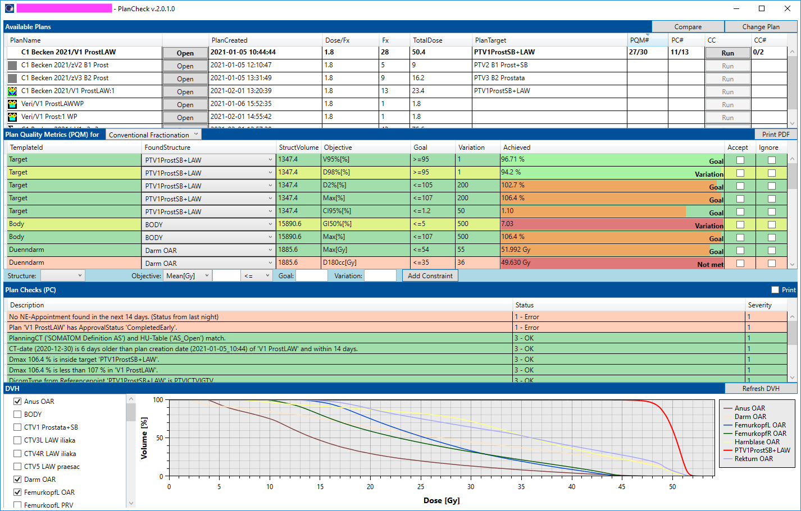

### 2. Contouring Assistant

GUI-assisted contouring workflow inspired by OptiAssistant-style ESAPI projects. The concept combines user input, Boolean structure operations, and review-oriented UI feedback.

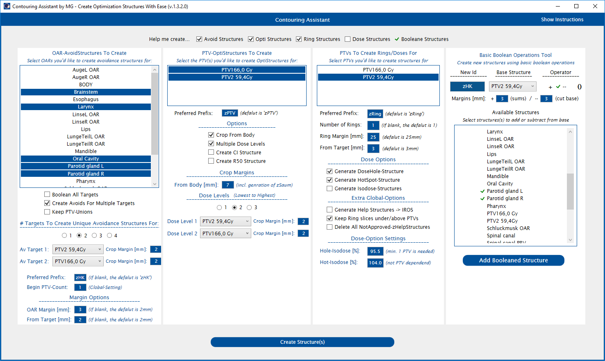

Union contouring concept:

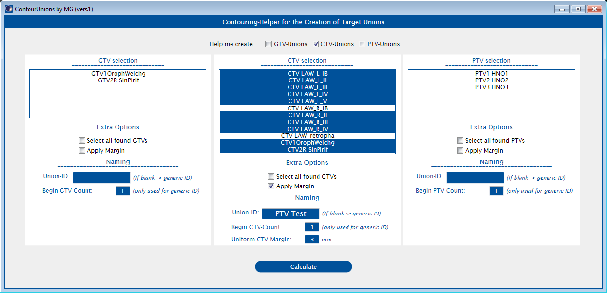

### 3. AutoPlan GUI

Autoplanning workflow with a user-facing GUI. The concept separates protocol/user input from execution so that additional planning features can be added incrementally.

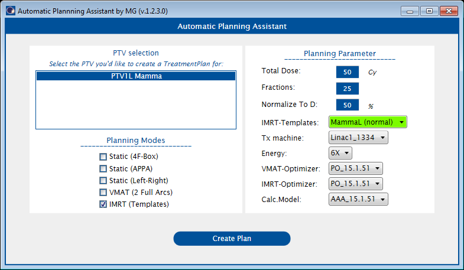

### 4. SRS/STX Index Check

Stereotactic plan review helper for Paddick conformity index and gradient index calculations for one or multiple targets in plans or plan sums.

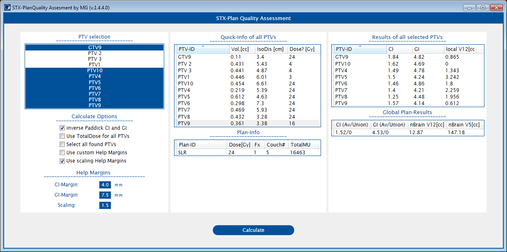

### 5. QA Exporter

Stand-alone export workflow for third-party QA programs, including pre-export and post-export checks such as portal dosimetry imager state, gating settings, and modality-specific export requirements.

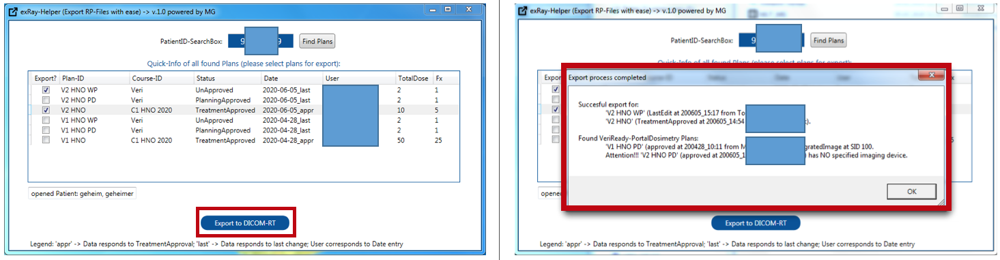

### 6. Eclipse Data Miner

Patient, plan, structure, and dose-metric data extraction for selected patients or filtered cohorts. The GUI concept was inspired by [tkmd94/EclipseDataMiner](https://github.com/tkmd94/EclipseDataMiner), with different output and local feature design.

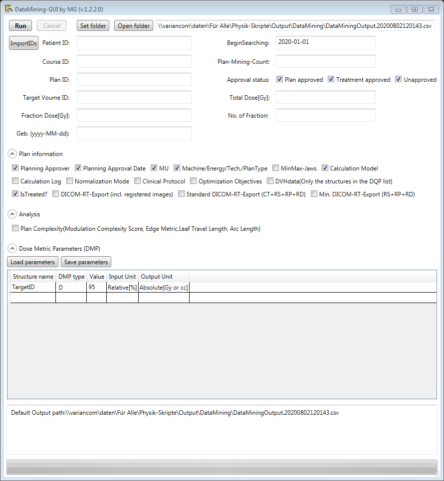

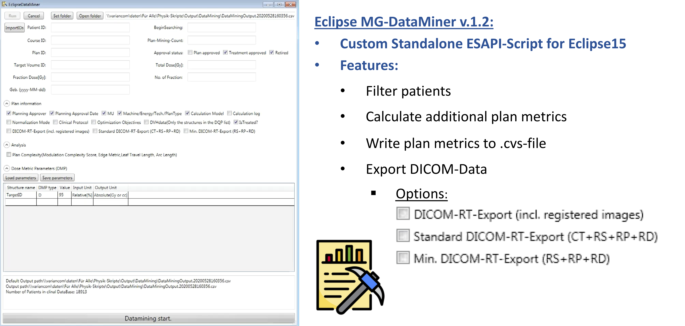

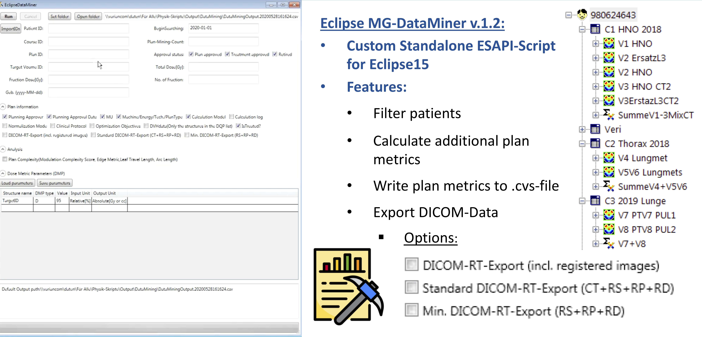

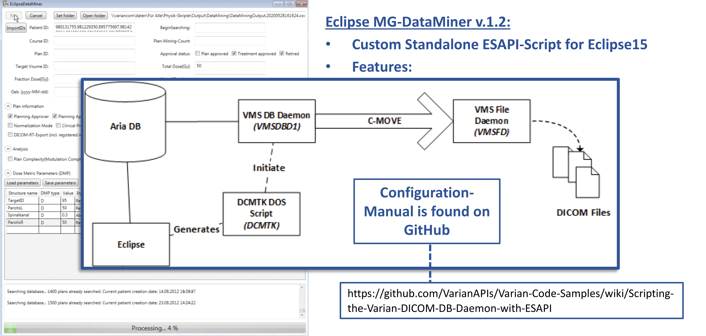

Example display of one plan; real exports are CSV-oriented:

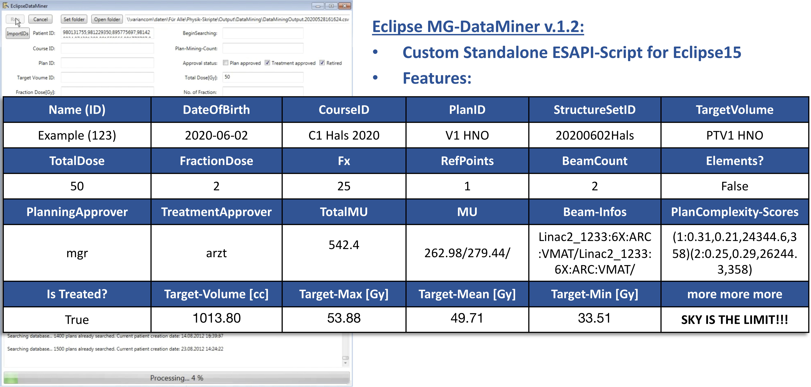

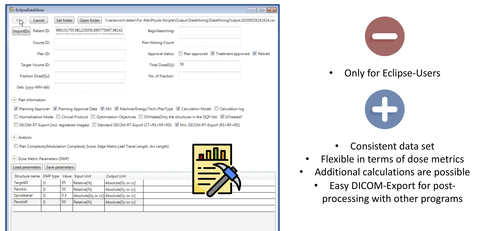

## AI Helper Skill

This repository includes a public, shareable ESAPI helper skill for AI assistants:

[`skills/esapi-scripting/SKILL.md`](skills/esapi-scripting/SKILL.md)

Use it to orient an assistant before asking for ESAPI script review, refactoring, plan-check logic, DVH metric handling, stand-alone lifetime review, or approval extension design.

Example prompt:

```text
Use the ESAPI helper skill in skills/esapi-scripting/SKILL.md.
Review this ESAPI plan-check script for null context handling, dose units,
stand-alone threading risks, write-enabled behavior, and clinical validation gaps.
```

## References

- Varian public ESAPI documentation hub: <https://docs.developer.varian.com/articles/index.html>
- Varian ESAPI object model article: <https://docs.developer.varian.com/articles/17.0/05_Eclipse_Scripting_API_Object_Model.html>
- Varian ESAPI online API help: <https://docs.developer.varian.com/api/index.html>
- Varian API Book: <https://varianapis.github.io/VarianApiBook.pdf>
- Gateway Scripts first look at ESAPI 18+ approval extensions: <https://www.gatewayscripts.com/post/script-approval-extensions-v18-scripting-first-look>
- Gateway approval extension example: <https://github.com/Gateway-Scripts/ApprovalChecks_ApprExt>
- LDClark PlanCheck: <https://github.com/LDClark/PlanCheck>
- EclipseDataMiner inspiration: <https://github.com/tkmd94/EclipseDataMiner>

## Clinical Safety

This repository does not provide medical software. Any ESAPI script used for patient care must be reviewed, tested, approved, commissioned, and maintained under the local clinical quality management system.

No license is currently granted for reuse of screenshots or implementation details. Treat the repository as educational showcase material unless a separate license is added.
